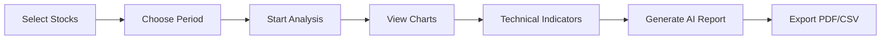

# 🧬 BioMarket Tracker

> **Professional Biotech Market Intelligence Platform | Powered by DeepSeek-V3**

[](https://streamlit.io/)
[](https://www.python.org/)
[](LICENSE)

A comprehensive biotech equity analysis platform that combines real-time market data, technical analysis, and AI-powered investment insights. Built for investors, analysts, and researchers in the biotechnology sector.

---

## 🌟 Key Features

### 📊 **Market Data & Analytics**
- **Real-time Price Tracking**: Live price updates for biotech stocks and ETFs
- **Performance Visualization**: Normalized price charts with benchmark comparison (SPY)
- **Risk-Return Analysis**: Beta, Volatility, Sharpe Ratio calculations
- **Correlation Heatmap**: Identify market relationships

### 📈 **Technical Analysis**
- **RSI (Relative Strength Index)**: Identify overbought/oversold conditions
- **MACD (Moving Average Convergence Divergence)**: Trend momentum signals
- **Bollinger Bands**: Volatility and price range analysis
- **Interactive Charts**: Powered by Plotly for deep-dive exploration

### 🤖 **AI-Powered Insights**
- **DeepSeek-V3 Integration**: Professional investment memo generation
- **Sector Analysis**: Market sentiment and trend identification
- **Actionable Recommendations**: Growth opportunities and risk management
- **Streaming Response**: Real-time AI analysis generation

### 🔔 **Smart Alerts & Management**
- **Price Alerts**: Get notified when stocks hit target prices
- **Favorites List**: Save and quickly load your watchlists
- **Auto-Refresh**: Optional 30-second data updates
- **Custom + Preset Stocks**: Combine your own picks with curated lists

### 📄 **Export & Reporting**
- **PDF Reports**: Professional-grade investment memos
- **CSV Export**: Raw data for further analysis
- **Timestamped Reports**: Track your analysis history

---

## 🚀 Live Demo

**[Try BioMarket Tracker Now →](https://your-app-url.streamlit.app)**

---

## 📸 Screenshots

### Main Dashboard

*Real-time price tracking with performance metrics*

### Technical Analysis

*RSI, MACD, and Bollinger Bands visualization*

### AI Investment Report

*DeepSeek-V3 generated professional analysis*

---

## 🛠️ Tech Stack

| Component | Technology |
|-----------|------------|
| **Frontend** | Streamlit |
| **Data Source** | Yahoo Finance API (yfinance) |
| **Visualization** | Plotly, Custom CSS |
| **AI Model** | DeepSeek-V3 API |
| **PDF Generation** | ReportLab |
| **Data Processing** | Pandas, NumPy |

---

## 📦 Installation

### Prerequisites
- Python 3.8 or higher
- pip package manager
- DeepSeek API key ([Get one here](https://platform.deepseek.com))

### Quick Start

1. **Clone the repository**
   ```bash
   git clone https://github.com/yourusername/biomarket-tracker.git
   cd biomarket-tracker
   ```

2. **Install dependencies**
   ```bash
   pip install -r requirements.txt
   ```

3. **Configure API Key**
   
   Open `app.py` and replace the API key:
   ```python
   DEEPSEEK_API_KEY = "your-api-key-here"
   ```
   
   Or use environment variable:
   ```bash
   export DEEPSEEK_API_KEY="your-api-key-here"
   ```

4. **Run the application**
   ```bash
   streamlit run app.py
   ```

5. **Open in browser**
   ```
   http://localhost:8501
   ```

---

## 📋 Requirements

```txt
streamlit>=1.28.0
yfinance>=0.2.28
pandas>=2.0.0
plotly>=5.17.0
openai>=1.3.0
reportlab>=4.0.0
numpy>=1.24.0
```

---

## 🎯 Usage Guide

### 1️⃣ **Stock Selection**

**Option A: Custom Search**
- Enter ticker symbols in the sidebar (e.g., `BNTX, CRSP, BEAM`)
- System validates tickers in real-time
- Supports global stock markets

**Option B: Preset List**
- Choose from curated biotech stocks
- Includes major ETFs (XBI, IBB)
- Popular pharma companies (MRNA, PFE, VRTX)

**Option C: Combine Both**
- Mix custom and preset selections
- Save combinations to Favorites

### 2️⃣ **Time Period Selection**
- 3 months
- 6 months
- 1 year (default)
- 3 years
- 5 years

### 3️⃣ **Analysis Workflow**



### 4️⃣ **Price Alerts**
1. Go to **Alerts** tab in sidebar
2. Select a stock
3. Set target price
4. Choose alert type (Above/Below)
5. Get notified when triggered

### 5️⃣ **AI Report Generation**
1. Complete stock analysis
2. Click **"Generate Report"** button
3. Watch AI draft in real-time
4. Export as PDF for sharing

---

## 🧮 Technical Indicators Explained

### RSI (Relative Strength Index)
- **Range**: 0-100
- **Overbought**: > 70 (potential sell signal)
- **Oversold**: < 30 (potential buy signal)
- **Neutral**: 30-70

### MACD (Moving Average Convergence Divergence)
- **Bullish Signal**: MACD crosses above signal line
- **Bearish Signal**: MACD crosses below signal line
- **Histogram**: Shows momentum strength

### Bollinger Bands
- **Upper Band**: Price resistance level
- **Lower Band**: Price support level
- **Squeeze**: Low volatility (potential breakout)
- **Expansion**: High volatility (trending market)

### Beta
- **β > 1**: More volatile than market
- **β = 1**: Moves with market
- **β < 1**: Less volatile than market
- **β < 0**: Inverse correlation (rare)

---

## 🤖 AI Analysis Features

### What DeepSeek-V3 Analyzes:

1. **Sector Overview**
   - Current biotech market sentiment
   - Risk-On vs Risk-Off environment
   - Performance vs broader market (SPY benchmark)

2. **Key Findings**
   - Top performers (best risk-adjusted returns)
   - Underperformers (high risk, low return)
   - Beta analysis (market correlation insights)

3. **Investment Strategy**
   - Growth opportunities (actionable long ideas)
   - Risk management (defensive positioning)
   - Portfolio allocation suggestions

### Sample AI Output:

```markdown
### Sector Overview
The biotech sector is showing Risk-On sentiment with XBI 
outperforming SPY by +8.3% over the past year...

### Key Findings
- VRTX demonstrates best risk-adjusted returns (Sharpe: 1.8)
- MRNA exhibits high volatility (45%) with negative returns
- Sector beta averaging 1.2x suggests amplified market moves

### Investment Strategy
Growth: Accumulate REGN on pullbacks below $850
Defense: Reduce GILD exposure, rotate to IBB for diversification
```

---

## 📊 Supported Stocks

### Preset Biotech Stocks

| Ticker | Company | Category |
|--------|---------|----------|
| **XBI** | SPDR S&P Biotech ETF | ETF |
| **IBB** | iShares Biotech ETF | ETF |
| **MRNA** | Moderna | mRNA Therapeutics |
| **PFE** | Pfizer | Big Pharma |
| **VRTX** | Vertex Pharmaceuticals | Rare Disease |
| **REGN** | Regeneron | Biologics |
| **AMGN** | Amgen | Biopharmaceuticals |
| **GILD** | Gilead Sciences | Antivirals |
| **LLY** | Eli Lilly | Diabetes/Oncology |
| **NVO** | Novo Nordisk | Diabetes |
| **SPY** | S&P 500 ETF | Benchmark |

### Custom Search
- Supports **any valid ticker** from Yahoo Finance
- Global markets (US, EU, Asia)
- Real-time validation
- Automatic name lookup

---

## 🔐 API Configuration

### DeepSeek API Setup

1. **Get API Key**
   - Visit [DeepSeek Platform](https://platform.deepseek.com)
   - Sign up for an account
   - Generate API key

2. **Configure in Code**
   ```python
   # Method 1: Direct in app.py
   DEEPSEEK_API_KEY = "sk-your-key-here"
   
   # Method 2: Environment variable (recommended)
   import os
   DEEPSEEK_API_KEY = os.getenv("DEEPSEEK_API_KEY")
   ```

3. **For Streamlit Cloud Deployment**
   - Go to App Settings → Secrets
   - Add:
     ```toml
     DEEPSEEK_API_KEY = "sk-your-key-here"
     ```
   - Update code:
     ```python
     DEEPSEEK_API_KEY = st.secrets["DEEPSEEK_API_KEY"]
     ```

---

## 🚀 Deployment

### Streamlit Cloud (Recommended)

1. **Push to GitHub**
   ```bash
   git add .
   git commit -m "Initial commit"
   git push origin main
   ```

2. **Deploy on Streamlit Cloud**
   - Go to [share.streamlit.io](https://share.streamlit.io)
   - Connect your GitHub repository
   - Select `app.py` as main file
   - Add API key in Secrets
   - Click Deploy

3. **Custom Domain (Optional)**
   - Configure in Streamlit Cloud settings
   - Add CNAME record in your DNS

### Docker Deployment

```dockerfile
FROM python:3.9-slim

WORKDIR /app

COPY requirements.txt .
RUN pip install --no-cache-dir -r requirements.txt

COPY . .

EXPOSE 8501

CMD ["streamlit", "run", "app.py", "--server.port=8501", "--server.address=0.0.0.0"]
```

```bash
docker build -t biomarket-tracker .
docker run -p 8501:8501 -e DEEPSEEK_API_KEY=your-key biomarket-tracker
```

---

## 🎨 Customization

### Add New Preset Stocks

```python
TICKER_MAP = {
    'XBI': 'XBI (标普生物科技ETF)',
    'YOUR_TICKER': 'YOUR_TICKER (Company Name)',  # Add here
    # ...
}
```

### Modify Technical Indicators

```python
# RSI Period
rsi = calculate_rsi(ticker_prices, period=14)  # Change period

# MACD Parameters
macd, signal, histogram = calculate_macd(
    ticker_prices, 
    fast=12,  # Fast EMA
    slow=26,  # Slow EMA
    signal=9  # Signal line
)

# Bollinger Bands
sma, upper_bb, lower_bb = calculate_bollinger_bands(
    ticker_prices, 
    period=20,   # SMA period
    std_dev=2    # Standard deviations
)
```

### Change Color Scheme

```python
# In CSS section
:root {
    --primary-color: #1e88e5;    # Blue
    --secondary-color: #43a047;  # Green
    --accent-color: #ff6f00;     # Orange
}
```

---

## 🐛 Troubleshooting

### Common Issues

**1. "ModuleNotFoundError: No module named 'yfinance'"**
```bash
pip install -r requirements.txt
```

**2. "Invalid API Key"**
- Check your DeepSeek API key
- Ensure no extra spaces
- Verify key is active

**3. "No data found for ticker"**
- Verify ticker symbol is correct
- Check if market is open
- Try a different ticker

**4. "Matplotlib not found" (if using old version)**
- Update to latest code (doesn't require matplotlib)
- Or install: `pip install matplotlib`

**5. Slow performance**
- Reduce number of selected stocks
- Use shorter time periods
- Disable auto-refresh

---

## 📈 Roadmap

### Planned Features

- [ ] **Multi-language Support** (中文界面)
- [ ] **Portfolio Backtesting** (Historical performance simulation)
- [ ] **News Sentiment Analysis** (NLP on biotech news)
- [ ] **Options Analytics** (Greeks, IV surface)
- [ ] **Peer Comparison** (Automatic competitor analysis)
- [ ] **Email Alerts** (Send notifications via email)
- [ ] **Mobile App** (React Native version)
- [ ] **API Endpoints** (RESTful API for integration)

### Version History

- **v1.0.0** (2026-02) - Initial release
  - Real-time data tracking
  - Technical indicators
  - AI report generation
  - PDF export

---

## 🤝 Contributing

Contributions are welcome! Please follow these steps:

1. **Fork the repository**
2. **Create a feature branch**
   ```bash
   git checkout -b feature/amazing-feature
   ```
3. **Commit your changes**
   ```bash
   git commit -m "Add amazing feature"
   ```
4. **Push to branch**
   ```bash
   git push origin feature/amazing-feature
   ```
5. **Open a Pull Request**

### Contribution Guidelines
- Follow PEP 8 style guide
- Add docstrings to functions
- Update README if needed
- Test thoroughly before submitting

---

## 📄 License

This project is licensed under the **MIT License** - see the [LICENSE](LICENSE) file for details.

```
MIT License

Copyright (c) 2026 Runze Zhu

Permission is hereby granted, free of charge, to any person obtaining a copy
of this software and associated documentation files (the "Software"), to deal
in the Software without restriction...
```

---

## 👨‍💻 Author

**Runze Zhu (朱润则)**
- 🎓 Business School, HKUST
- 💼 Medical Finance Advisor Intern @ Haoyue Capital
- 🔬 Interests: Finance + Bioengineering
- 📧 Email: [rzhuar@connect.ust.hk](mailto:your-email@example.com)
- 💼 LinkedIn: [https://www.linkedin.com/in/runze-zhu-8143b4380/](https://linkedin.com/in/runze-zhu)
- 🐙 GitHub: [@LeoZhu6](https://github.com/yourusername)

---

## 🙏 Acknowledgments

- **DeepSeek** - AI model provider
- **Yahoo Finance** - Market data source
- **Streamlit** - Web framework
- **Plotly** - Interactive charts
- **HKUST** - Academic support

---

## ⚠️ Disclaimer

**Important Notice:**

This software is provided for **educational and informational purposes only**. It is **NOT** intended as:

- Investment advice
- Financial consulting
- Trading recommendations
- Professional guidance

**Key Points:**

1. ✅ **Use at Your Own Risk**: All investment decisions are your responsibility
2. ✅ **No Guarantees**: Past performance does not indicate future results
3. ✅ **Consult Professionals**: Seek advice from licensed financial advisors
4. ✅ **AI Limitations**: AI-generated reports may contain errors or biases
5. ✅ **Data Accuracy**: Market data may have delays or inaccuracies

The author and contributors assume **no liability** for any financial losses incurred through the use of this software.

---

## 📞 Support

- 🐛 **Bug Reports**: [Open an issue](https://github.com/LeoZhu6/biotech-market-tracker/issues)
- 📧 **Email**: rzhuar@connect.ust.hk
- 💬 **Discussions**: [GitHub Discussions](https://github.com/LeoZhu6/biotech-market-tracker/discussions)

---

## Star History

[](https://www.star-history.com/#LeoZhu6/biomarket-tracker&type=date&legend=top-left)

---

<div align="center">

### Made with ❤️ by Runze Zhu

**If you find this project helpful, please consider giving it a ⭐!**

[Report Bug](https://github.com/LeoZhu6/biomarket-tracker/issues) · 
[Request Feature](https://github.com/LeoZhu6/biomarket-tracker/issues) · 
[Documentation](https://github.com/LeoZhu6/biomarket-tracker/wiki)

</div>
