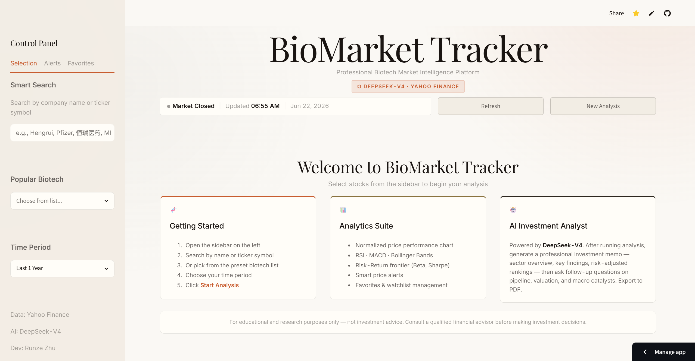
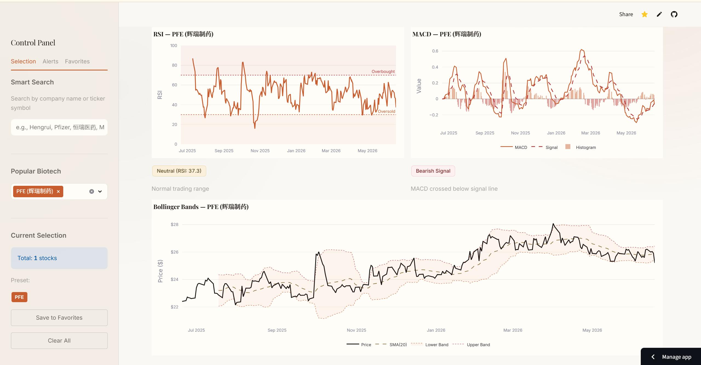
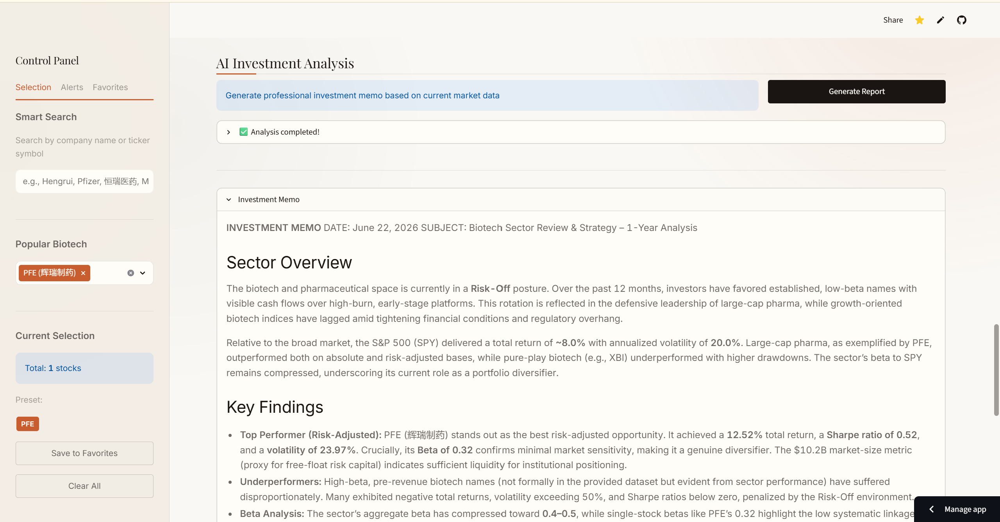

# 🧬 BioMarket Tracker

> **Professional Biotech Market Intelligence Platform | Powered by DeepSeek-V4**

[](https://streamlit.io/)
[](https://www.python.org/)
[](LICENSE)

A biotech equity analysis platform combining real-time market data, technical analysis, and AI-powered investment insights — built for investors, analysts, and researchers in the biotechnology sector.

**[🚀 Live Demo →](https://runze-bio-market-tracker.streamlit.app/)**

---

## 🖥️ Preview

<div align="center">
  
</div>

<br>

<div align="center">
  <table>
    <tr>
      <td align="center"><b>Technical Analysis</b></td>
      <td align="center"><b>AI Investment Report</b></td>
    </tr>
    <tr>
      <td width="50%"></td>
      <td width="50%"></td>
    </tr>
  </table>
</div>

---

## 🌟 Features

- **📊 Market Data** — Real-time prices, normalized performance vs. SPY, beta / volatility / Sharpe, correlation heatmap
- **📈 Technical Analysis** — RSI, MACD, Bollinger Bands with interactive Plotly charts
- **🤖 AI Insights** — DeepSeek-V4 (`deepseek-v4-pro`) investment memos + an interactive chat to ask follow-up questions
- **🔍 Smart Search** — Fuzzy ticker search incl. A-share / Chinese-name lookup (pinyin + translation), plus per-company news feed
- **🔔 Alerts & Watchlists** — Price alerts, favorites, optional auto-refresh, custom + preset stock lists
- **📄 Export** — PDF investment memos and CSV data export

---

## 🛠️ Tech Stack

| Layer | Technology |
|-------|------------|
| Frontend | Streamlit (Anthropic-inspired warm theme) |
| Data | Yahoo Finance (yfinance) |
| Visualization | Plotly, Matplotlib/Seaborn |
| AI | DeepSeek-V4 API (via `openai` SDK) |
| Search / i18n | googlesearch-python, pypinyin, deep-translator |
| Reporting | ReportLab, Pandas, NumPy |

---

## 🚀 Quick Start

```bash
# 1. Clone
git clone https://github.com/LeoZhu6/biotech-market-tracker.git
cd biotech-market-tracker

# 2. Install
pip install -r requirements.txt

# 3. Configure API key (.env in project root)
echo 'DEEPSEEK_API_KEY=sk-your-key-here' > .env

# 4. Run
streamlit run app.py        # opens http://localhost:8501
```

Get a DeepSeek API key at [platform.deepseek.com](https://platform.deepseek.com). On **Streamlit Cloud**, add the key under *App Settings → Secrets* — `os.getenv("DEEPSEEK_API_KEY")` picks it up automatically.

---

## 🎯 Usage

1. **Select stocks** — type tickers / company names in the sidebar, or pick from the preset biotech list (XBI, IBB, MRNA, VRTX, REGN, …). Custom and preset selections can be combined and saved to Favorites.
2. **Choose a period** — 3M / 6M / 1Y / 3Y / 5Y.
3. **Analyze** — view performance charts, risk metrics, and technical indicators.
4. **Generate AI report** — stream a DeepSeek-V4 memo, then ask follow-ups in the chat or export to PDF.
5. **Set alerts** — pick a stock, set a target price, choose Above/Below.

Custom search supports any valid Yahoo Finance ticker (US / EU / Asia, including A-shares).

---

## 📈 Roadmap

- [x] Chinese / A-share search, company news feed, interactive AI chat, warm UI redesign
- [ ] News sentiment analysis (NLP) · portfolio backtesting · peer comparison · email alerts

---

## 👨‍💻 Author

**Runze Zhu (朱润则)** — Business School, HKUST · Finance + Bioengineering
📧 [rzhuar@connect.ust.hk](mailto:rzhuar@connect.ust.hk) · 💼 [LinkedIn](https://www.linkedin.com/in/runze-zhu-8143b4380/) · 🐙 [@LeoZhu6](https://github.com/LeoZhu6)

---

## ⚠️ Disclaimer

For **educational and informational purposes only** — not investment advice. AI-generated reports and market data may contain errors or delays. All investment decisions are your own responsibility; consult a licensed financial advisor. Past performance does not indicate future results.

---

## 📄 License

Licensed under the **MIT License** — see [LICENSE](LICENSE). Copyright © 2026 Runze Zhu.

<div align="center">

**If you find this project helpful, please consider giving it a ⭐!**

[Report Bug](https://github.com/LeoZhu6/biotech-market-tracker/issues) · [Request Feature](https://github.com/LeoZhu6/biotech-market-tracker/issues)

</div>
